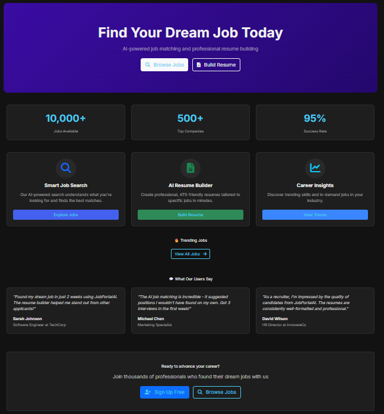
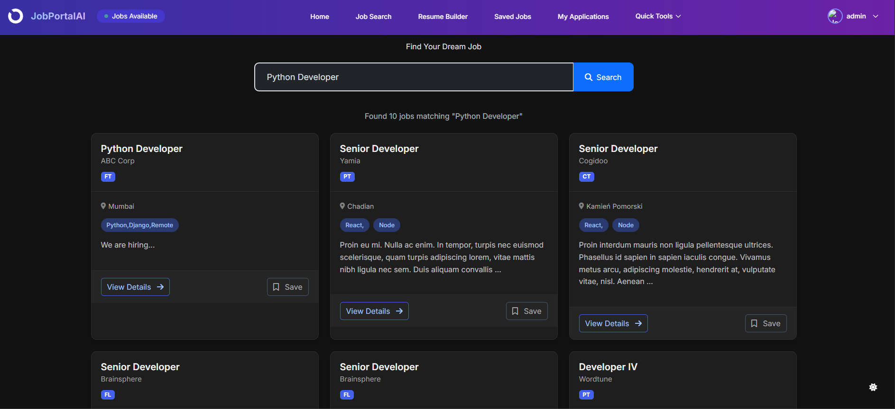
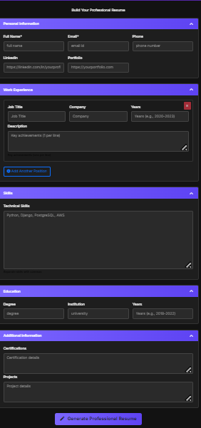
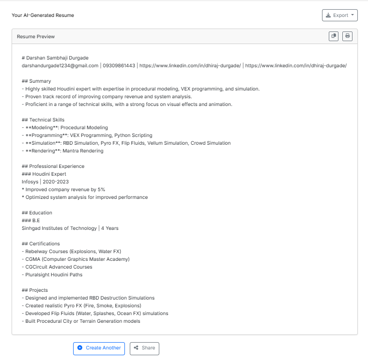
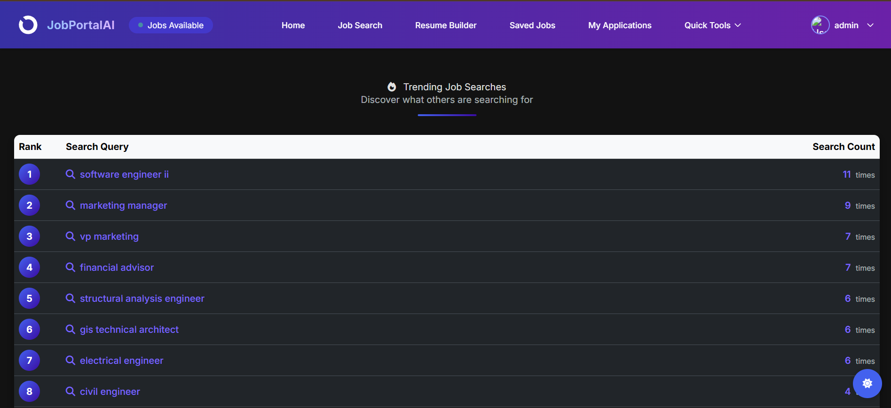

## 📄 Job Portal & AI Resume Generator

An advanced Django web application that enables users to:

* 🔍 Search jobs using **Elasticsearch**
* ⚡ Cache popular searches with **Redis**
* 🧠 Generate smart AI-powered resumes using **GROQ/OpenAI**
* 📄 Export resumes as downloadable PDFs
* 📈 View trending job search terms with analytics

---

### 🚀 Features

| Module                      | Description                                              |
| --------------------------- | -------------------------------------------------------- |
| 🔍 **Job Search**           | Full-text Elasticsearch search with filters              |
| 📂 **Redis Caching**        | Caches search results and trending queries               |
| 📝 **Resume Generator**     | Takes user experience & skills → outputs AI summary      |
| 📋 **PDF Export**           | Converts resume HTML to downloadable PDF via `xhtml2pdf` |
| 📈 **Trending Insights**    | Tracks and shows top job search keywords                 |
| 🔐 **User Auth (Optional)** | Login/Logout with Django Allauth integration             |

---

### 💠 Tech Stack

* **Backend:** Django, Django REST Framework
* **Search Engine:** Elasticsearch 8.x
* **Caching:** Redis
* **AI:** OpenAI / GROQ (gpt-4o / mixtral)
* **PDF Generation:** xhtml2pdf
* **Frontend:** Bootstrap 5, Tailwind CSS header
* **Database:** SQLite (switchable to PostgreSQL/MySQL)

---

### 🌐 Main Pages

| Page                 | URL                     |
| -------------------- | ----------------------- |
| 🏠 Home              | `/`                     |
| 🔍 Search Jobs       | `/search/`              |
| 📝 Resume Generator  | `/apply/`               |
| 📈 Trending Keywords | `/trending/`            |
| 📋 Resume Download   | After resume generation |

---

### 📸 Screenshots

| Screenshot                                     | Description                                                   |
| ---------------------------------------------- | ------------------------------------------------------------- |
|                   | 🏠 **Home Page** – Overview and entry point to all features   |
|       | 🔍 **Job Search** – Elasticsearch-powered search with filters |
|     | 📝 **Resume Generator Form** – Applicant form for AI summary  |
|     | 📋 **Resume Success** – PDF download confirmation view        |
|  | 📈 **Trending Page** – Top searched job queries visualized    |

---

### ⚙️ Setup Instructions

1. **Clone the repo**

```bash
git clone https://github.com/dhirajdurgade7758/jobportal.git
cd jobportal
```

2. **Create virtual environment**

```bash
python -m venv venv
source venv/bin/activate  # Windows: venv\Scripts\activate
```

3. **Install dependencies**

```bash
pip install -r requirements.txt
```

4. **Set up environment variables**

Create `.env` file:

```env
SECRET_KEY=your_django_secret
GROQ_API_KEY=your_groq_or_openai_key
DEBUG=True
```

5. **Start services**

Make sure **Redis** and **Elasticsearch 8.x** are running.

6. **Run server**

```bash
python manage.py migrate
python manage.py runserver
```

---

### ✅ Highlights

* 100% functional AI resume builder
* Elasticsearch-backed scalable search
* Caching via Redis for speed
* Production-ready, modular Django codebase
* Easy to extend with authentication, dashboards, etc.

---

### 🙌 Credits

* Bootstrap & Tailwind UI
* GROQ (OpenAI-compatible API)
* xhtml2pdf for PDF rendering
* Django & Elasticsearch communities

---

### ✨ Want to Contribute?

Feel free to fork, star, and raise PRs or issues.
This project is a great foundation for job boards, resume tools, or career assistant apps!


